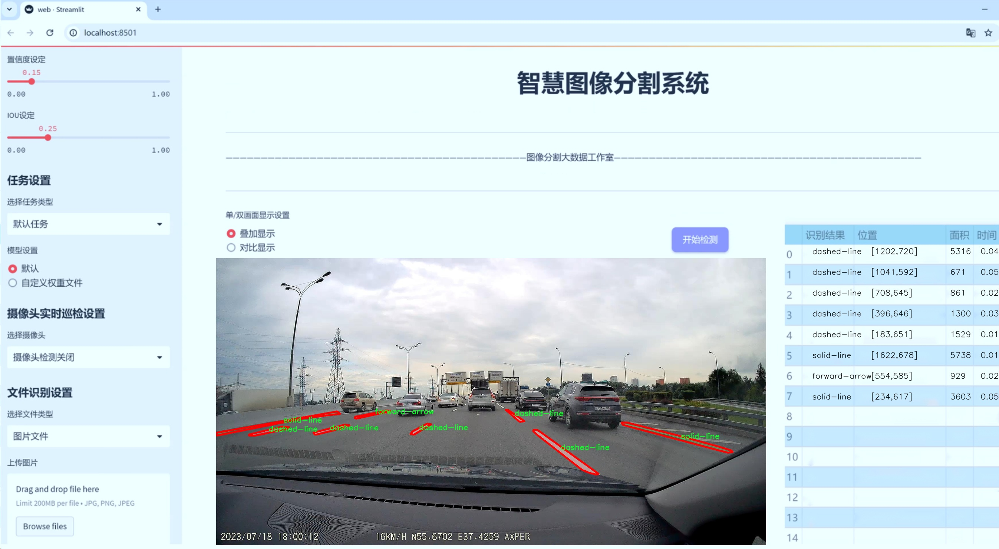
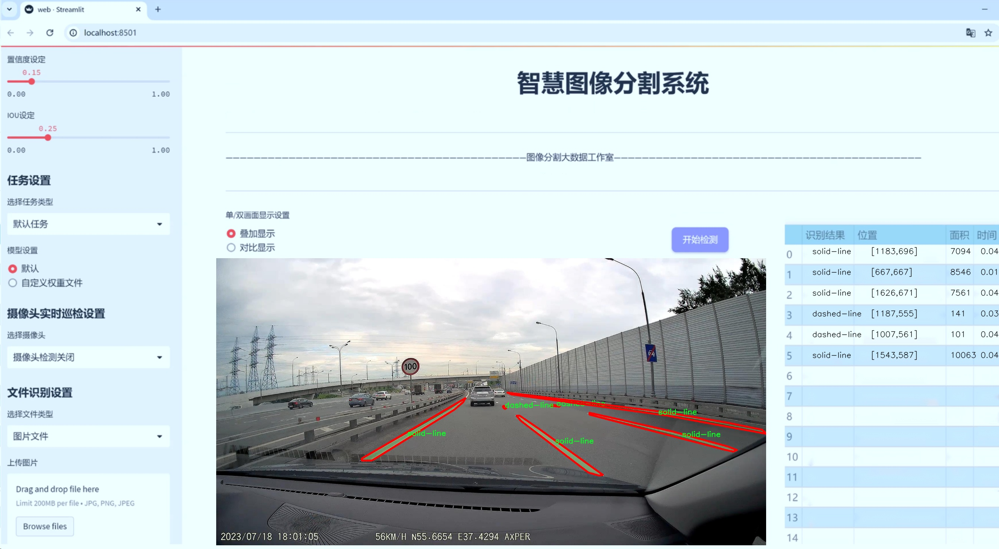
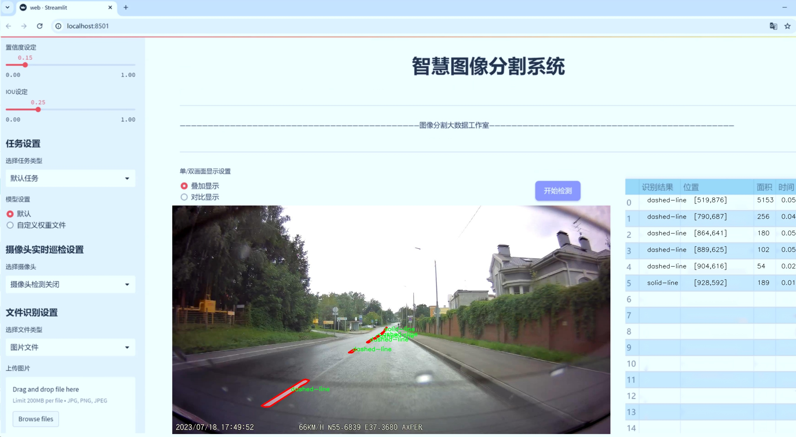
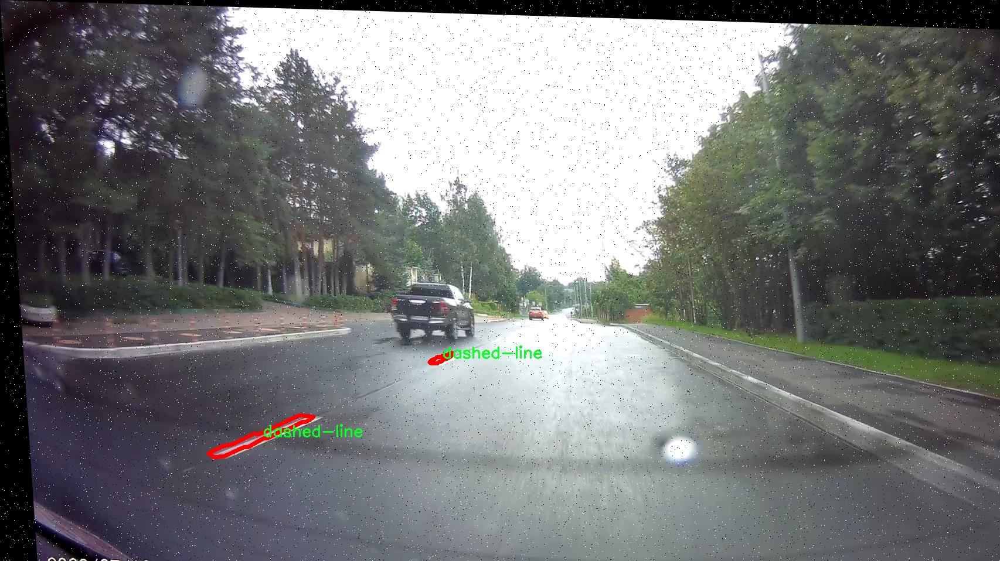
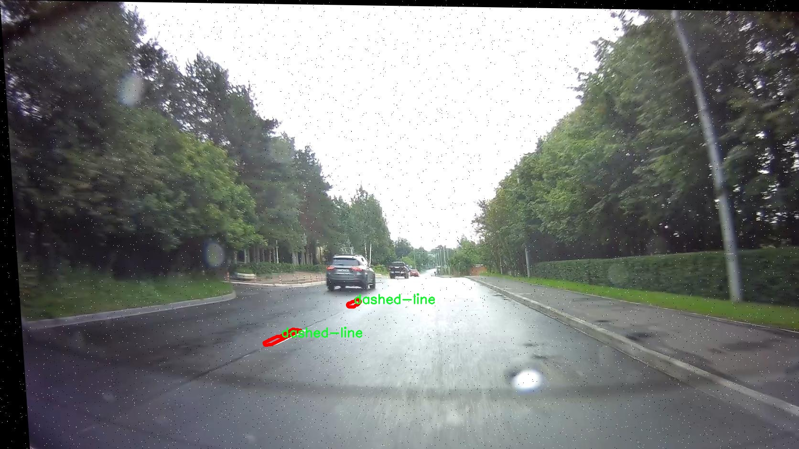
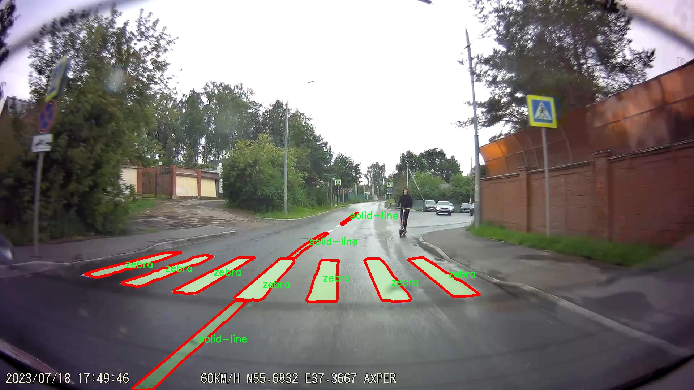
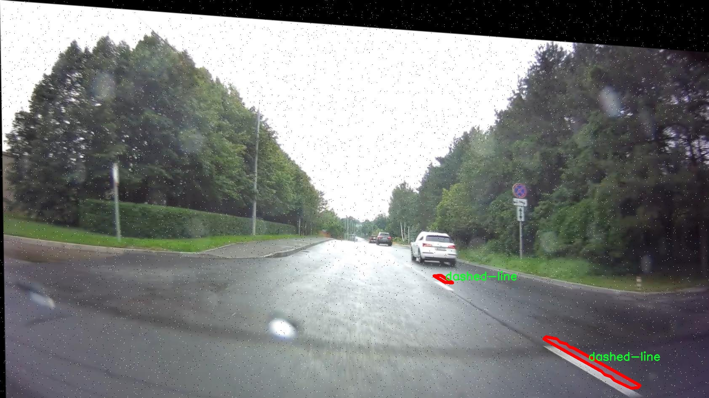
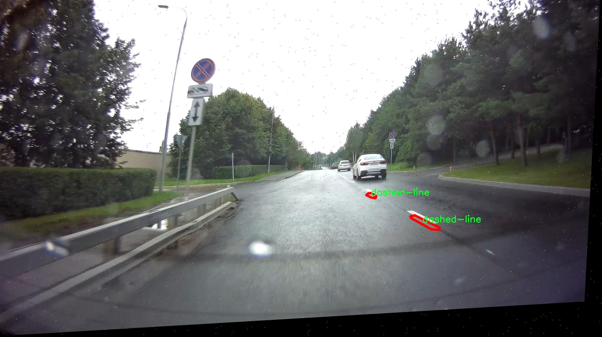

# 交通标线车道线分割系统源码＆数据集分享
 [yolov8-seg-C2f-EMSC＆yolov8-seg-SPPF-LSKA等50+全套改进创新点发刊_一键训练教程_Web前端展示]

### 1.研究背景与意义

项目参考[ILSVRC ImageNet Large Scale Visual Recognition Challenge](https://gitee.com/YOLOv8_YOLOv11_Segmentation_Studio/projects)

项目来源[AAAI Global Al lnnovation Contest](https://kdocs.cn/l/cszuIiCKVNis)

研究背景与意义

随着城市化进程的加快，交通管理面临着日益严峻的挑战。交通标线作为道路交通管理的重要组成部分，不仅为驾驶员提供了行驶指引，还在交通安全中发挥着不可或缺的作用。传统的交通标线检测方法多依赖于人工标注和规则识别，效率低下且易受环境因素影响，难以适应复杂多变的道路情况。因此，基于深度学习的自动化交通标线检测与分割技术逐渐成为研究热点。

YOLO（You Only Look Once）系列模型因其高效的实时检测能力而受到广泛关注。尤其是YOLOv8的推出，进一步提升了目标检测的精度和速度，使其在交通标线检测中展现出巨大的潜力。通过改进YOLOv8模型，我们可以更好地适应交通标线的多样性和复杂性，从而实现更为精准的车道线分割。当前，针对交通标线的实例分割任务尚处于研究的初级阶段，相关数据集的构建和模型的优化仍需深入探索。

本研究将基于一个包含2800张图像的交通标线数据集，该数据集涵盖了11种不同类型的交通标线，包括虚线、双实线、各种箭头和斑马线等。这些标线在不同的道路场景中扮演着不同的角色，具有较强的多样性和复杂性。通过对这些标线进行实例分割，我们不仅可以提高交通标线的检测精度，还能为智能交通系统的建设提供基础数据支持。研究表明，准确的交通标线识别与分割能够有效降低交通事故发生率，提高道路通行效率。

此外，随着自动驾驶技术的迅猛发展，交通标线的自动识别与分割已成为实现安全驾驶的重要前提。改进YOLOv8的交通标线车道线分割系统，不仅可以为自动驾驶汽车提供实时的环境感知能力，还能为未来的智能交通管理系统提供重要的数据支持。通过精准的交通标线识别，自动驾驶系统能够更好地理解道路状况，从而做出更为合理的行驶决策。

综上所述，本研究的意义在于通过改进YOLOv8模型，提升交通标线的实例分割能力，为智能交通系统和自动驾驶技术的发展提供技术支持。同时，研究将推动交通标线检测领域的进步，促进相关算法的优化与应用，为未来的交通安全和管理提供更加智能化的解决方案。通过对交通标线的深入研究，我们不仅能够提高交通管理的效率，还能为实现更安全、更智能的城市交通环境贡献力量。

### 2.图片演示







##### 注意：由于此博客编辑较早，上面“2.图片演示”和“3.视频演示”展示的系统图片或者视频可能为老版本，新版本在老版本的基础上升级如下：（实际效果以升级的新版本为准）

  （1）适配了YOLOV8的“目标检测”模型和“实例分割”模型，通过加载相应的权重（.pt）文件即可自适应加载模型。

  （2）支持“图片识别”、“视频识别”、“摄像头实时识别”三种识别模式。

  （3）支持“图片识别”、“视频识别”、“摄像头实时识别”三种识别结果保存导出，解决手动导出（容易卡顿出现爆内存）存在的问题，识别完自动保存结果并导出到tempDir中。

  （4）支持Web前端系统中的标题、背景图等自定义修改，后面提供修改教程。

  另外本项目提供训练的数据集和训练教程,暂不提供权重文件（best.pt）,需要您按照教程进行训练后实现图片演示和Web前端界面演示的效果。

### 3.视频演示

[3.1 视频演示](https://www.bilibili.com/video/BV1LfmVYoEkj/)

### 4.数据集信息展示

##### 4.1 本项目数据集详细数据（类别数＆类别名）

nc: 11
names: ['dashed-line', 'double-solid', 'forward-arrow', 'forward-left-arrow', 'forward-right-arrow', 'left-arrow', 'parking', 'right-arrow', 'solid-broken', 'solid-line', 'zebra']


##### 4.2 本项目数据集信息介绍

数据集信息展示

在本研究中，我们使用了名为“razmetka”的数据集，旨在改进YOLOv8-seg模型在交通标线车道线分割任务中的表现。该数据集专门设计用于训练和评估模型在复杂交通环境中对车道线的准确识别与分割能力。razmetka数据集包含11个类别，涵盖了各种常见的交通标线，具体类别包括：虚线（dashed-line）、双实线（double-solid）、直行箭头（forward-arrow）、直行左转箭头（forward-left-arrow）、直行右转箭头（forward-right-arrow）、左转箭头（left-arrow）、停车标线（parking）、右转箭头（right-arrow）、实线与虚线组合（solid-broken）、实线（solid-line）以及斑马线（zebra）。这些类别的选择不仅反映了交通标线的多样性，也为模型的训练提供了丰富的样本。

在数据集的构建过程中，razmetka数据集经过精心的标注，确保每一类交通标线都能被准确识别。数据集中的图像来源于不同的城市道路和交通场景，涵盖了各种天气条件和光照变化，以增强模型的鲁棒性。每个类别的标线在图像中都有明确的标注，便于模型学习和理解不同标线的特征及其在交通环境中的功能。

在训练过程中，YOLOv8-seg模型将利用razmetka数据集进行深度学习，模型将通过卷积神经网络（CNN）提取图像特征，并通过多层次的特征融合来实现对交通标线的精确分割。数据集的多样性和丰富性将极大地提升模型的泛化能力，使其能够在真实世界的复杂场景中有效识别和分割不同类型的交通标线。

此外，razmetka数据集的设计还考虑到了标线的实际应用场景，例如，停车标线和斑马线在城市交通管理中扮演着重要角色，能够帮助驾驶员做出正确的行驶决策。通过对这些标线的精确分割，改进后的YOLOv8-seg模型不仅可以提高自动驾驶系统的安全性，还能为交通监控和管理提供有力的数据支持。

为了确保模型的训练效果，razmetka数据集还包含了丰富的图像变换和增强技术，如旋转、缩放、裁剪和颜色调整等，这些技术将进一步提升模型对不同场景的适应能力。此外，数据集的划分策略也经过深思熟虑，确保训练集、验证集和测试集的合理分配，以便于对模型性能的全面评估。

总之，razmetka数据集为改进YOLOv8-seg的交通标线车道线分割系统提供了坚实的基础。通过对该数据集的深入分析与应用，我们期望能够推动交通标线识别技术的发展，为智能交通系统的实现贡献力量。随着研究的深入，razmetka数据集的应用将不仅限于车道线分割，还可能扩展到更广泛的交通场景理解与分析中，为未来的交通管理与安全提供更为智能化的解决方案。











### 5.全套项目环境部署视频教程（零基础手把手教学）

[5.1 环境部署教程链接（零基础手把手教学）](https://www.bilibili.com/video/BV1jG4Ve4E9t/?vd_source=bc9aec86d164b67a7004b996143742dc)


[5.2 安装Python虚拟环境创建和依赖库安装视频教程链接（零基础手把手教学）](https://www.bilibili.com/video/BV1nA4VeYEze/?vd_source=bc9aec86d164b67a7004b996143742dc)

### 6.手把手YOLOV8-seg训练视频教程（零基础小白有手就能学会）

[6.1 手把手YOLOV8-seg训练视频教程（零基础小白有手就能学会）](https://www.bilibili.com/video/BV1cA4VeYETe/?vd_source=bc9aec86d164b67a7004b996143742dc)


按照上面的训练视频教程链接加载项目提供的数据集，运行train.py即可开始训练



     Epoch   gpu_mem       box       obj       cls    labels  img_size
     1/200     0G   0.01576   0.01955  0.007536        22      1280: 100%|██████████| 849/849 [14:42<00:00,  1.04s/it]
               Class     Images     Labels          P          R     mAP@.5 mAP@.5:.95: 100%|██████████| 213/213 [01:14<00:00,  2.87it/s]
                 all       3395      17314      0.994      0.957      0.0957      0.0843

     Epoch   gpu_mem       box       obj       cls    labels  img_size
     2/200     0G   0.01578   0.01923  0.007006        22      1280: 100%|██████████| 849/849 [14:44<00:00,  1.04s/it]
               Class     Images     Labels          P          R     mAP@.5 mAP@.5:.95: 100%|██████████| 213/213 [01:12<00:00,  2.95it/s]
                 all       3395      17314      0.996      0.956      0.0957      0.0845

     Epoch   gpu_mem       box       obj       cls    labels  img_size
     3/200     0G   0.01561    0.0191  0.006895        27      1280: 100%|██████████| 849/849 [10:56<00:00,  1.29it/s]
               Class     Images     Labels          P          R     mAP@.5 mAP@.5:.95: 100%|███████   | 187/213 [00:52<00:00,  4.04it/s]
                 all       3395      17314      0.996      0.957      0.0957      0.0845


### 7.50+种全套YOLOV8-seg创新点代码加载调参视频教程（一键加载写好的改进模型的配置文件）

[7.1 50+种全套YOLOV8-seg创新点代码加载调参视频教程（一键加载写好的改进模型的配置文件）](https://www.bilibili.com/video/BV1Hw4VePEXv/?vd_source=bc9aec86d164b67a7004b996143742dc)

### 8.YOLOV8-seg图像分割算法原理

原始YOLOv8-seg算法原理

YOLOv8-seg算法是目标检测领域中的一项重要进展，旨在提高图像分割和目标检测的精度与效率。作为YOLO系列的最新版本，YOLOv8-seg在YOLOv5的基础上进行了多项创新和改进，尤其是在数据预处理、网络结构、标签分配策略等方面，展现了其独特的优势。

首先，YOLOv8-seg在数据预处理方面延续了YOLOv5的成功经验，采用了多种数据增强技术以提升模型的鲁棒性和泛化能力。具体而言，YOLOv8-seg引入了马赛克增强、混合增强、空间扰动和颜色扰动等四种增强手段。这些技术不仅能够丰富训练数据的多样性，还能有效减少模型对特定样本的过拟合，从而提升其在真实场景中的表现。特别是马赛克增强，通过将多张图像拼接成一张新的图像，能够帮助模型更好地学习到不同物体之间的关系和背景信息。

在网络结构方面，YOLOv8-seg继承了YOLOv5的设计理念，但在关键模块上进行了重要的创新。YOLOv8-seg的骨干网络结构中，C3模块被替换为C2f模块，后者引入了更多的分支结构，以增强梯度回传时的信息流动。这种设计使得模型在特征提取过程中能够获得更丰富的上下文信息，从而提升目标检测和分割的精度。此外，YOLOv8-seg依然采用了特征金字塔网络（FPN）和路径聚合网络（PAN）结构，以实现多尺度特征的有效融合，确保模型在处理不同尺寸目标时的稳定性和准确性。

YOLOv8-seg在检测头的设计上也进行了创新，采用了解耦头结构。这一结构将分类和定位任务分开处理，分别通过两条并行的分支提取类别特征和位置特征。通过这种方式，模型能够更专注于各自任务的特征提取，进而提高了检测的精度和收敛速度。这种解耦设计的引入，显著提升了模型在复杂场景下的表现，使得YOLOv8-seg在处理重叠目标或背景复杂的情况下，依然能够保持较高的检测性能。

标签分配策略的改进也是YOLOv8-seg的一大亮点。与YOLOv5依赖于聚类候选框的策略不同，YOLOv8-seg采用了动态标签分配策略，结合了TOOD（Task-Oriented Object Detection）方法。这一策略通过对目标框和目标分数的动态调整，优化了正负样本的匹配过程。具体而言，YOLOv8-seg在损失函数中引入了Varifocal Loss（VFL）和CIoU Loss的组合，前者通过不对称参数加权正负样本的损失，后者则关注边界框的回归精度。这种设计使得模型在训练过程中能够更有效地聚焦于高质量的正样本，进而提升整体的检测精度。

在实际应用中，YOLOv8-seg展现出了卓越的性能。通过对COCO数据集的测试，YOLOv8-seg在多个指标上均取得了显著的提升，尤其是在mAP（mean Average Precision）和推理速度方面。与前代模型相比，YOLOv8-seg不仅在精度上有了43.23%的提升，帧率也提高了10.28倍，极大地增强了其在实时目标检测和分割任务中的应用潜力。

总的来说，YOLOv8-seg算法通过一系列的创新和改进，成功地提升了目标检测和分割的精度与效率。其在数据预处理、网络结构、标签分配策略等方面的优化，使得YOLOv8-seg不仅适用于智能监控、自动驾驶等领域，还能够广泛应用于医疗影像分析、工业缺陷检测等多种场景。随着YOLOv8-seg的不断发展和完善，未来在目标检测领域的应用前景将更加广阔。


### 9.系统功能展示（检测对象为举例，实际内容以本项目数据集为准）

图9.1.系统支持检测结果表格显示

  图9.2.系统支持置信度和IOU阈值手动调节

  图9.3.系统支持自定义加载权重文件best.pt(需要你通过步骤5中训练获得)

  图9.4.系统支持摄像头实时识别

  图9.5.系统支持图片识别

  图9.6.系统支持视频识别

  图9.7.系统支持识别结果文件自动保存

  图9.8.系统支持Excel导出检测结果数据


### 10.50+种全套YOLOV8-seg创新点原理讲解（非科班也可以轻松写刊发刊，V11版本正在科研待更新）

#### 10.1 由于篇幅限制，每个创新点的具体原理讲解就不一一展开，具体见下列网址中的创新点对应子项目的技术原理博客网址【Blog】：


[10.1 50+种全套YOLOV8-seg创新点原理讲解链接](https://gitee.com/qunmasj/good)

#### 10.2 部分改进模块原理讲解(完整的改进原理见上图和技术博客链接)【如果此小节的图加载失败可以通过CSDN或者Github搜索该博客的标题访问原始博客，原始博客图片显示正常】
### YOLOv8简介

YOLOv8 是 Ultralytics 公司继 YOLOv5 算法之后开发的下一代算法模型，目前支持图像分类、物体检测和实例分割任务。YOLOv8 是一个 SOTA 模型，它建立在之前YOLO 系列模型的成功基础上，并引入了新的功能和改进，以进一步提升性能和灵活性。具体创新包括：一个新的骨干网络、一个新的 Ancher-Free 检测头和一个新的损失函数，可以在从 CPU 到 GPU 的各种硬件平台上运行。注意到ultralytics 并没有直接将开源库命名为 YOLOv8，而是直接使用 Ultralytics这个单词，原因是Ultralytics这个库的定位是算法框架，而非特指某一个特定算法，其希望这个库不仅仅能够用于 YOLO 系列模型，同时也能支持其他的视觉任务如图像分类、实例分割等。下图画图YOLOv8目标检测算法同其他YOLO系列算法（YOLOv5、6、7）的实验对比图，左边是模型参数量对比，右边是速度对比。


下面两个表分别是YOLOv8和YOLOv5（v7.0版本）官方在 COCO Val 2017 数据集上测试结果，从中看出 YOLOv8 相比 YOLOv5 精度提升大，但是 N/S/M 模型相应的参数量、FLOPS等提高了不少。


#### YOLOv8概述
提供了一个全新的SOTA模型，和YOLOv5一样，基于缩放系数也提供了 N/S/M/L/X 尺度的不同大小模型，用于满足不同场景需求，同时支持图像分类、目标检测、实例分割和姿态检测任务
在骨干网络和Neck部分将YOLOv5的C3结构换成了梯度流更丰富的 C2f 结构，并对不同尺度模型调整了不同的通道数，大幅提升了模型性能；需要注意的是C2f 模块中存在Split等操作对特定硬件部署没有之前那么友好


Head部分换成了目前主流的解耦头结构，将分类和检测头分离，同时也从 Anchor-Based换成了Anchor-Free Loss
计算方面采用了 TaskAlignedAssigner 正样本分配策略，并引入了 Distribution Focal Loss
下图画出YOLOv8目标检测算法的整体结构图


#### YOLOv8模型
YOLOv8目标检测算法的模型配置文件如下：


从配置文件可以看出，YOLOv8与YOLOv5模型最明显的差异是使用C2F模块替换了原来的C3模块，两个模块的结构图下图所示。


另外Head 部分变化最大，从原先的耦合头变成了解耦头，并且从 YOLOv5 的 Anchor-Based 变成了 Anchor-Free。其结构对比图如下所示：

### RepViT简介

近年来，与轻量级卷积神经网络(cnn)相比，轻量级视觉变压器(ViTs)在资源受限的移动设备上表现出了更高的性能和更低的延迟。这种改进通常归功于多头自注意模块，它使模型能够学习全局表示。然而，轻量级vit和轻量级cnn之间的架构差异还没有得到充分的研究。在这项研究中，我们重新审视了轻量级cnn的高效设计，并强调了它们在移动设备上的潜力。通过集成轻量级vit的高效架构选择，我们逐步增强了标准轻量级CNN的移动友好性，特别是MobileNetV3。这就产生了一个新的纯轻量级cnn家族，即RepViT。大量的实验表明，RepViT优于现有的轻型vit，并在各种视觉任务中表现出良好的延迟。在ImageNet上，RepViT在iPhone 12上以近1ms的延迟实现了超过80%的top-1精度，据我们所知，这是轻量级模型的第一次。

#### RepViT简介
轻量级模型研究一直是计算机视觉任务中的一个焦点，其目标是在降低计算成本的同时达到优秀的性能。轻量级模型与资源受限的移动设备尤其相关，使得视觉模型的边缘部署成为可能。在过去十年中，研究人员主要关注轻量级卷积神经网络（CNNs）的设计，提出了许多高效的设计原则，包括可分离卷积 、逆瓶颈结构 、通道打乱 和结构重参数化等，产生了 MobileNets ，ShuffleNets和 RepVGG 等代表性模型。

另一方面，视觉 Transformers（ViTs）成为学习视觉表征的另一种高效方案。与 CNNs 相比，ViTs 在各种计算机视觉任务中表现出了更优越的性能。然而，ViT 模型一般尺寸很大，延迟很高，不适合资源受限的移动设备。因此，研究人员开始探索 ViT 的轻量级设计。许多高效的ViTs设计原则被提出，大大提高了移动设备上 ViTs 的计算效率，产生了EfficientFormers ，MobileViTs等代表性模型。这些轻量级 ViTs 在移动设备上展现出了相比 CNNs 的更强的性能和更低的延迟。

轻量级 ViTs 优于轻量级 CNNs 的原因通常归结于多头注意力模块，该模块使模型能够学习全局表征。然而，轻量级 ViTs 和轻量级 CNNs 在块结构、宏观和微观架构设计方面存在值得注意的差异，但这些差异尚未得到充分研究。这自然引出了一个问题：轻量级 ViTs 的架构选择能否提高轻量级 CNN 的性能？在这项工作中，我们结合轻量级 ViTs 的架构选择，重新审视了轻量级 CNNs 的设计。我们的旨在缩小轻量级 CNNs 与轻量级 ViTs 之间的差距，并强调前者与后者相比在移动设备上的应用潜力。


在 ConvNeXt 中，参考该博客提出的基于 ResNet50 架构的基础上通过严谨的理论和实验分析，最终设计出一个非常优异的足以媲美 Swin-Transformer 的纯卷积神经网络架构。同样地，RepViT也是主要通过将轻量级 ViTs 的架构设计逐步整合到标准轻量级 CNN，即MobileNetV3-L，来对其进行针对性地改造（魔改）。在这个过程中，作者们考虑了不同粒度级别的设计元素，并通过一系列步骤达到优化的目标。


详细优化步骤如下：

#### 训练配方的对齐
论文中引入了一种衡量移动设备上延迟的指标，并将训练策略与现有的轻量级 ViTs 对齐。这一步骤主要是为了确保模型训练的一致性，其涉及两个概念，即延迟度量和训练策略的调整。

#### 延迟度量指标
为了更准确地衡量模型在真实移动设备上的性能，作者选择了直接测量模型在设备上的实际延迟，以此作为基准度量。这个度量方法不同于之前的研究，它们主要通过FLOPs或模型大小等指标优化模型的推理速度，这些指标并不总能很好地反映在移动应用中的实际延迟。

#### 训练策略的对齐
这里，将 MobileNetV3-L 的训练策略调整以与其他轻量级 ViTs 模型对齐。这包括使用 AdamW 优化器-ViTs 模型必备的优化器，进行 5 个 epoch 的预热训练，以及使用余弦退火学习率调度进行 300 个 epoch 的训练。尽管这种调整导致了模型准确率的略微下降，但可以保证公平性。

#### 块设计的优化
基于一致的训练设置，作者们探索了最优的块设计。块设计是 CNN 架构中的一个重要组成部分，优化块设计有助于提高网络的性能。

#### 分离 Token 混合器和通道混合器
这块主要是对 MobileNetV3-L 的块结构进行了改进，分离了令牌混合器和通道混合器。原来的 MobileNetV3 块结构包含一个 1x1 扩张卷积，然后是一个深度卷积和一个 1x1 的投影层，然后通过残差连接连接输入和输出。在此基础上，RepViT 将深度卷积提前，使得通道混合器和令牌混合器能够被分开。为了提高性能，还引入了结构重参数化来在训练时为深度滤波器引入多分支拓扑。最终，作者们成功地在 MobileNetV3 块中分离了令牌混合器和通道混合器，并将这种块命名为 RepViT 块。

#### 降低扩张比例并增加宽度
在通道混合器中，原本的扩张比例是 4，这意味着 MLP 块的隐藏维度是输入维度的四倍，消耗了大量的计算资源，对推理时间有很大的影响。为了缓解这个问题，我们可以将扩张比例降低到 2，从而减少了参数冗余和延迟，使得 MobileNetV3-L 的延迟降低到 0.65ms。随后，通过增加网络的宽度，即增加各阶段的通道数量，Top-1 准确率提高到 73.5%，而延迟只增加到 0.89ms！

#### 宏观架构元素的优化
在这一步，本文进一步优化了MobileNetV3-L在移动设备上的性能，主要是从宏观架构元素出发，包括 stem，降采样层，分类器以及整体阶段比例。通过优化这些宏观架构元素，模型的性能可以得到显著提高。

#### 浅层网络使用卷积提取器
ViTs 通常使用一个将输入图像分割成非重叠补丁的 “patchify” 操作作为 stem。然而，这种方法在训练优化性和对训练配方的敏感性上存在问题。因此，作者们采用了早期卷积来代替，这种方法已经被许多轻量级 ViTs 所采纳。对比之下，MobileNetV3-L 使用了一个更复杂的 stem 进行 4x 下采样。这样一来，虽然滤波器的初始数量增加到24，但总的延迟降低到0.86ms，同时 top-1 准确率提高到 73.9%。

#### 更深的下采样层
在 ViTs 中，空间下采样通常通过一个单独的补丁合并层来实现。因此这里我们可以采用一个单独和更深的下采样层，以增加网络深度并减少由于分辨率降低带来的信息损失。具体地，作者们首先使用一个 1x1 卷积来调整通道维度，然后将两个 1x1 卷积的输入和输出通过残差连接，形成一个前馈网络。此外，他们还在前面增加了一个 RepViT 块以进一步加深下采样层，这一步提高了 top-1 准确率到 75.4%，同时延迟为 0.96ms。

#### 更简单的分类器
在轻量级 ViTs 中，分类器通常由一个全局平均池化层后跟一个线性层组成。相比之下，MobileNetV3-L 使用了一个更复杂的分类器。因为现在最后的阶段有更多的通道，所以作者们将它替换为一个简单的分类器，即一个全局平均池化层和一个线性层，这一步将延迟降低到 0.77ms，同时 top-1 准确率为 74.8%。

#### 整体阶段比例
阶段比例代表了不同阶段中块数量的比例，从而表示了计算在各阶段中的分布。论文选择了一个更优的阶段比例 1:1:7:1，然后增加网络深度到 2:2:14:2，从而实现了一个更深的布局。这一步将 top-1 准确率提高到 76.9%，同时延迟为 1.02 ms。

#### 卷积核大小的选择
众所周知，CNNs 的性能和延迟通常受到卷积核大小的影响。例如，为了建模像 MHSA 这样的远距离上下文依赖，ConvNeXt 使用了大卷积核，从而实现了显著的性能提升。然而，大卷积核对于移动设备并不友好，因为它的计算复杂性和内存访问成本。MobileNetV3-L 主要使用 3x3 的卷积，有一部分块中使用 5x5 的卷积。作者们将它们替换为3x3的卷积，这导致延迟降低到 1.00ms，同时保持了76.9%的top-1准确率。

#### SE 层的位置
自注意力模块相对于卷积的一个优点是根据输入调整权重的能力，这被称为数据驱动属性。作为一个通道注意力模块，SE层可以弥补卷积在缺乏数据驱动属性上的限制，从而带来更好的性能。MobileNetV3-L 在某些块中加入了SE层，主要集中在后两个阶段。然而，与分辨率较高的阶段相比，分辨率较低的阶段从SE提供的全局平均池化操作中获得的准确率提升较小。作者们设计了一种策略，在所有阶段以交叉块的方式使用SE层，从而在最小的延迟增量下最大化准确率的提升，这一步将top-1准确率提升到77.4%，同时延迟降低到0.87ms。

注意！【这一点其实百度在很早前就已经做过实验比对得到过这个结论了，SE 层放置在靠近深层的地方效果好】

#### 微观设计的调整
RepViT 通过逐层微观设计来调整轻量级 CNN，这包括选择合适的卷积核大小和优化挤压-激励（Squeeze-and-excitation，简称SE）层的位置。这两种方法都能显著改善模型性能。

#### 网络架构
最终，通过整合上述改进策略，我们便得到了模型RepViT的整体架构，该模型有多个变种，例如RepViT-M1/M2/M3。同样地，不同的变种主要通过每个阶段的通道数和块数来区分。


### 11.项目核心源码讲解（再也不用担心看不懂代码逻辑）

#### 11.1 ui.py

以下是代码的核心部分，并附上详细的中文注释：

```python
import sys
import subprocess

def run_script(script_path):
    """
    使用当前 Python 环境运行指定的脚本。

    Args:
        script_path (str): 要运行的脚本路径

    Returns:
        None
    """
    # 获取当前 Python 解释器的路径
    python_path = sys.executable

    # 构建运行命令，使用 streamlit 运行指定的脚本
    command = f'"{python_path}" -m streamlit run "{script_path}"'

    # 执行命令，并等待其完成
    result = subprocess.run(command, shell=True)
    
    # 检查命令执行的返回码，如果不为0则表示出错
    if result.returncode != 0:
        print("脚本运行出错。")

# 实例化并运行应用
if __name__ == "__main__":
    # 指定要运行的脚本路径
    script_path = "web.py"  # 这里可以直接使用相对路径

    # 调用函数运行脚本
    run_script(script_path)
```

### 代码分析与注释：
1. **导入模块**：
   - `sys`：用于访问与 Python 解释器相关的变量和函数。
   - `subprocess`：用于创建新进程、连接到它们的输入/输出/错误管道，并获得它们的返回码。

2. **`run_script` 函数**：
   - 功能：接受一个脚本路径，使用当前 Python 环境运行该脚本。
   - 参数：
     - `script_path`：要运行的脚本的完整路径。
   - 过程：
     - 获取当前 Python 解释器的路径。
     - 构建一个命令字符串，使用 `streamlit` 模块运行指定的脚本。
     - 使用 `subprocess.run` 执行命令，并等待其完成。
     - 检查返回码，如果不为0，打印错误信息。

3. **主程序块**：
   - 只有在直接运行该脚本时，以下代码才会执行。
   - 指定要运行的脚本路径（在这里是 `web.py`）。
   - 调用 `run_script` 函数，传入脚本路径以执行该脚本。

### 注意事项：
- 在实际使用中，`script_path` 可以根据需要进行修改，以适应不同的脚本文件。
- 此代码假设 `streamlit` 已安装并可用。

这个程序文件名为 `ui.py`，它的主要功能是运行一个指定的 Python 脚本，具体来说是使用 Streamlit 框架来启动一个 Web 应用。

首先，文件中导入了一些必要的模块，包括 `sys`、`os` 和 `subprocess`。`sys` 模块用于访问与 Python 解释器交互的变量和函数，`os` 模块提供了与操作系统交互的功能，而 `subprocess` 模块则用于执行外部命令。

接下来，程序定义了一个名为 `run_script` 的函数，该函数接受一个参数 `script_path`，表示要运行的脚本的路径。在函数内部，首先获取当前 Python 解释器的路径，这通过 `sys.executable` 实现。然后，构建一个命令字符串，该命令使用当前的 Python 解释器和 Streamlit 模块来运行指定的脚本。具体的命令格式为 `"{python_path}" -m streamlit run "{script_path}"`。

之后，使用 `subprocess.run` 方法执行构建好的命令。这个方法会在一个新的进程中运行命令，并等待其完成。如果命令执行的返回码不为零，表示脚本运行出错，程序会打印出相应的错误信息。

在文件的最后部分，使用 `if __name__ == "__main__":` 语句来确保只有在直接运行该脚本时才会执行以下代码。这里指定了要运行的脚本路径为 `web.py`，并调用 `run_script` 函数来启动这个脚本。

总体来说，这个文件的功能是提供一个简单的接口，通过命令行启动一个基于 Streamlit 的 Web 应用，便于开发和测试。

#### 11.2 ultralytics\data\utils.py

以下是经过简化并添加详细中文注释的核心代码部分：

```python
import os
import hashlib
from pathlib import Path
from PIL import Image, ImageOps
import numpy as np

# 定义支持的图像格式
IMG_FORMATS = 'bmp', 'jpeg', 'jpg', 'png', 'tif', 'tiff', 'webp'  # 支持的图像后缀

def img2label_paths(img_paths):
    """根据图像路径定义标签路径"""
    # 将图像路径中的'/images/'替换为'/labels/'，并将后缀改为.txt
    sa, sb = f'{os.sep}images{os.sep}', f'{os.sep}labels{os.sep}'  
    return [sb.join(x.rsplit(sa, 1)).rsplit('.', 1)[0] + '.txt' for x in img_paths]

def get_hash(paths):
    """返回路径列表（文件或目录）的单个哈希值"""
    size = sum(os.path.getsize(p) for p in paths if os.path.exists(p))  # 计算文件大小总和
    h = hashlib.sha256(str(size).encode())  # 基于大小生成哈希
    h.update(''.join(paths).encode())  # 基于路径生成哈希
    return h.hexdigest()  # 返回哈希值

def exif_size(img: Image.Image):
    """返回经过EXIF校正的PIL图像大小"""
    s = img.size  # 获取图像大小（宽度，高度）
    if img.format == 'JPEG':  # 仅支持JPEG格式
        try:
            exif = img.getexif()  # 获取EXIF信息
            if exif:
                rotation = exif.get(274, None)  # 获取方向标签
                if rotation in [6, 8]:  # 处理旋转情况
                    s = s[1], s[0]  # 交换宽高
        except Exception:
            pass  # 忽略异常
    return s

def verify_image(im_file):
    """验证单个图像的有效性"""
    nf, nc, msg = 0, 0, ''  # 计数器初始化
    try:
        im = Image.open(im_file)  # 打开图像
        im.verify()  # 验证图像
        shape = exif_size(im)  # 获取图像大小
        assert (shape[0] > 9) & (shape[1] > 9), f'图像大小 {shape} 小于10像素'  # 检查图像大小
        assert im.format.lower() in IMG_FORMATS, f'无效的图像格式 {im.format}'  # 检查图像格式
        nf = 1  # 图像有效计数
    except Exception as e:
        nc = 1  # 图像无效计数
        msg = f'警告 ⚠️ {im_file}: 忽略损坏的图像: {e}'  # 错误信息
    return im_file, nf, nc, msg  # 返回图像文件名和计数信息

def verify_image_label(im_file, lb_file):
    """验证图像-标签对的有效性"""
    nf, nc, msg = 0, 0, ''  # 计数器初始化
    try:
        # 验证图像
        im = Image.open(im_file)
        im.verify()  # 验证图像
        shape = exif_size(im)  # 获取图像大小
        assert (shape[0] > 9) & (shape[1] > 9), f'图像大小 {shape} 小于10像素'  # 检查图像大小
        assert im.format.lower() in IMG_FORMATS, f'无效的图像格式 {im.format}'  # 检查图像格式
        nf = 1  # 图像有效计数

        # 验证标签
        if os.path.isfile(lb_file):
            nf = 1  # 标签文件存在
            with open(lb_file) as f:
                lb = [x.split() for x in f.read().strip().splitlines() if len(x)]  # 读取标签
                lb = np.array(lb, dtype=np.float32)  # 转换为numpy数组
            nl = len(lb)  # 标签数量
            if nl:
                assert lb.shape[1] == 5, f'标签需要5列, 检测到 {lb.shape[1]} 列'  # 检查标签列数
                assert lb.min() >= 0, f'标签值不能为负 {lb[lb < 0]}'  # 检查标签值
            else:
                msg = f'警告 ⚠️ {im_file}: 标签为空'  # 标签为空警告
        else:
            msg = f'警告 ⚠️ {im_file}: 标签缺失'  # 标签缺失警告
    except Exception as e:
        nc = 1  # 图像无效计数
        msg = f'警告 ⚠️ {im_file}: 忽略损坏的图像/标签: {e}'  # 错误信息
    return im_file, nf, shape, msg  # 返回图像文件名和计数信息
```

### 代码说明
1. **img2label_paths**: 根据图像路径生成对应的标签路径，主要用于将图像文件名转换为标签文件名。
2. **get_hash**: 计算给定路径列表的哈希值，主要用于数据完整性检查。
3. **exif_size**: 获取图像的实际尺寸，考虑到EXIF信息（如旋转）。
4. **verify_image**: 验证单个图像的有效性，包括格式和尺寸检查。
5. **verify_image_label**: 验证图像及其对应标签的有效性，确保标签文件存在且格式正确。

这个程序文件是Ultralytics YOLO项目中的一个工具模块，主要用于处理与数据集相关的操作。文件中导入了多个库和模块，包括文件处理、图像处理、哈希计算、以及多线程处理等。接下来，我将对文件中的主要功能和函数进行说明。

首先，文件定义了一些常量，包括支持的图像和视频格式，以及一个全局变量`PIN_MEMORY`，用于设置数据加载器的内存固定选项。接下来的函数主要围绕图像和标签的验证、数据集的检查与下载、以及图像的处理等功能展开。

`img2label_paths`函数根据图像路径生成对应的标签路径。`get_hash`函数计算给定路径列表的哈希值，以便在数据集的完整性检查中使用。`exif_size`函数用于获取图像的EXIF信息，以便返回正确的图像尺寸。

`verify_image`和`verify_image_label`函数分别用于验证单个图像和图像-标签对的有效性。这些函数会检查图像格式、尺寸，以及标签文件的存在性和有效性，并在发现问题时返回相应的警告信息。

`polygon2mask`和`polygons2masks`函数用于将多边形转换为二进制掩码，支持图像分割任务。`find_dataset_yaml`函数用于查找与数据集相关的YAML文件，并确保只找到一个有效的文件。

`check_det_dataset`和`check_cls_dataset`函数用于检查检测和分类数据集的有效性，包括下载数据集、解析YAML文件、验证路径等。它们会确保数据集的结构符合要求，并提供必要的警告信息。

`HUBDatasetStats`类用于生成HUB数据集的统计信息，包括数据集的JSON文件和目录结构。它支持下载数据集、处理图像，并生成统计信息。

最后，`compress_one_image`函数用于压缩单个图像文件，保持其宽高比和质量。`autosplit`函数则用于自动将数据集划分为训练、验证和测试集，并将结果保存到文本文件中。

总体而言，这个模块提供了一系列工具函数和类，旨在简化数据集的管理和处理，确保数据集的完整性和有效性，为YOLO模型的训练和推理提供支持。

#### 11.3 ultralytics\utils\torch_utils.py

以下是经过简化并添加详细中文注释的核心代码部分：

```python
import torch
import torch.nn as nn
import torch.nn.functional as F
import numpy as np
import os
import random
import time
from contextlib import contextmanager

@contextmanager
def torch_distributed_zero_first(local_rank: int):
    """在分布式训练中，确保所有进程等待本地主进程完成某些操作。"""
    initialized = torch.distributed.is_available() and torch.distributed.is_initialized()
    if initialized and local_rank not in (-1, 0):
        torch.distributed.barrier(device_ids=[local_rank])  # 同步其他进程
    yield
    if initialized and local_rank == 0:
        torch.distributed.barrier(device_ids=[0])  # 主进程完成后同步

def select_device(device='', batch=0, verbose=True):
    """
    根据提供的参数选择合适的PyTorch设备。

    Args:
        device (str | torch.device, optional): 设备字符串或torch.device对象。
        batch (int, optional): 模型使用的批量大小。
        verbose (bool, optional): 如果为True，则记录设备信息。

    Returns:
        (torch.device): 选择的设备。
    """
    if isinstance(device, torch.device):
        return device

    device = str(device).lower().replace(' ', '')  # 处理设备字符串
    if device in ('cpu', 'none'):
        os.environ['CUDA_VISIBLE_DEVICES'] = '-1'  # 强制使用CPU
        arg = 'cpu'
    else:
        os.environ['CUDA_VISIBLE_DEVICES'] = device  # 设置可见设备
        if not torch.cuda.is_available():
            raise ValueError(f"无效的CUDA设备: {device}")
        arg = 'cuda:0'  # 默认使用第一个CUDA设备

    if verbose:
        print(f"使用设备: {arg}")
    return torch.device(arg)

def time_sync():
    """返回PyTorch准确的时间。"""
    if torch.cuda.is_available():
        torch.cuda.synchronize()  # 确保CUDA同步
    return time.time()

def initialize_weights(model):
    """初始化模型权重为随机值。"""
    for m in model.modules():
        if isinstance(m, nn.Conv2d):
            nn.init.kaiming_normal_(m.weight, mode='fan_out', nonlinearity='relu')  # 使用He初始化
        elif isinstance(m, nn.BatchNorm2d):
            m.eps = 1e-3  # 设置BatchNorm的epsilon
            m.momentum = 0.03  # 设置动量

def scale_img(img, ratio=1.0, gs=32):
    """根据给定的比例和网格大小缩放和填充图像张量。"""
    if ratio == 1.0:
        return img
    h, w = img.shape[2:]  # 获取图像的高度和宽度
    img = F.interpolate(img, size=(int(h * ratio), int(w * ratio)), mode='bilinear', align_corners=False)  # 调整大小
    # 填充图像以满足网格大小要求
    return F.pad(img, [0, gs - (w % gs), 0, gs - (h % gs)], value=0.447)  # 使用ImageNet均值填充

def init_seeds(seed=0, deterministic=False):
    """初始化随机数生成器的种子。"""
    random.seed(seed)
    np.random.seed(seed)
    torch.manual_seed(seed)
    torch.cuda.manual_seed(seed)
    if deterministic:
        torch.use_deterministic_algorithms(True)  # 使用确定性算法
    else:
        torch.use_deterministic_algorithms(False)

class EarlyStopping:
    """早停类，当指定的epochs数没有改进时停止训练。"""

    def __init__(self, patience=50):
        """初始化早停对象。"""
        self.best_fitness = 0.0  # 最佳适应度
        self.best_epoch = 0  # 最佳epoch
        self.patience = patience  # 等待的epochs数

    def __call__(self, epoch, fitness):
        """检查是否停止训练。"""
        if fitness is None:
            return False

        if fitness >= self.best_fitness:  # 如果当前适应度更好
            self.best_epoch = epoch
            self.best_fitness = fitness
        stop = (epoch - self.best_epoch) >= self.patience  # 检查是否超过耐心值
        if stop:
            print(f'早停训练，最佳结果在第 {self.best_epoch} 轮，最佳适应度为 {self.best_fitness}.')
        return stop
```

### 代码说明
1. **torch_distributed_zero_first**: 该上下文管理器用于在分布式训练中确保所有进程等待本地主进程完成某些操作。
2. **select_device**: 选择合适的设备（CPU或CUDA），并设置环境变量以指定可见的CUDA设备。
3. **time_sync**: 返回当前时间，确保CUDA操作的同步。
4. **initialize_weights**: 初始化模型的权重，使用He初始化卷积层的权重，并设置BatchNorm的参数。
5. **scale_img**: 根据给定的比例和网格大小缩放和填充图像。
6. **init_seeds**: 初始化随机数生成器的种子，以确保实验的可重复性。
7. **EarlyStopping**: 实现早停机制，根据指定的耐心值在训练过程中监控适应度并决定是否停止训练。

这个程序文件是Ultralytics YOLO项目中的一个工具模块，主要用于处理与PyTorch相关的各种功能和操作。代码中导入了多个库，包括数学、操作系统、平台、随机数生成、时间管理、上下文管理器、深拷贝、路径处理以及类型提示等。它还导入了NumPy和PyTorch的相关模块，以及Ultralytics的其他工具。

首先，文件中定义了一些常量，用于检查当前PyTorch版本是否符合特定要求。这些常量在后续的函数中用于确保兼容性。

接下来，定义了一个上下文管理器`torch_distributed_zero_first`，用于在分布式训练中确保所有进程在本地主进程完成某些操作之前等待。这对于同步操作非常重要。

`smart_inference_mode`函数根据PyTorch的版本选择合适的推理模式装饰器，以提高推理效率。

`get_cpu_info`函数返回系统CPU的信息，使用了`py-cpuinfo`库来获取详细的CPU信息。

`select_device`函数用于选择合适的PyTorch设备（CPU或GPU）。它根据用户提供的设备字符串或torch.device对象，返回一个torch.device对象，并检查设备的可用性。函数还会记录设备信息，并在使用多个GPU时检查批量大小是否可被设备数量整除。

`time_sync`函数用于同步CUDA时间，确保在多GPU环境下的时间测量准确。

`fuse_conv_and_bn`和`fuse_deconv_and_bn`函数用于将卷积层和批归一化层融合，以提高模型的推理速度和效率。

`model_info`函数用于打印模型的基本信息，包括参数数量、梯度数量和层数等。它还可以计算模型的FLOPs（每秒浮点运算次数），以评估模型的计算复杂度。

`get_num_params`和`get_num_gradients`函数分别用于获取模型的总参数数量和具有梯度的参数数量。

`model_info_for_loggers`函数返回一个包含模型信息的字典，适用于日志记录。

`get_flops`和`get_flops_with_torch_profiler`函数用于计算模型的FLOPs，前者使用`thop`库，后者使用PyTorch的内置分析器。

`initialize_weights`函数用于初始化模型的权重。

`scale_img`函数用于根据给定的比例和网格大小调整和填充图像张量。

`make_divisible`函数返回最接近的可被指定除数整除的值。

`copy_attr`函数用于从一个对象复制属性到另一个对象，并可以选择性地包含或排除某些属性。

`get_latest_opset`函数返回当前PyTorch版本支持的最新ONNX opset。

`intersect_dicts`函数返回两个字典中具有相同形状的交集键的字典。

`is_parallel`和`de_parallel`函数用于检查模型是否为并行模型，并将其转换为单GPU模型。

`one_cycle`函数返回一个用于从y1到y2的正弦波形变化的lambda函数。

`init_seeds`函数用于初始化随机数生成器的种子，以确保实验的可重复性。

`ModelEMA`类实现了指数移动平均（EMA）更新，用于保持模型参数的移动平均，以提高模型的稳定性。

`strip_optimizer`函数用于从模型中去除优化器，以便在训练完成后保存最终模型。

`profile`函数用于对模型进行速度、内存和FLOPs的分析。

最后，`EarlyStopping`类实现了早停机制，用于在训练过程中监控模型的性能，并在指定的耐心周期内没有改进时停止训练。

总体而言，这个模块提供了许多实用的工具和功能，旨在提高YOLO模型的训练和推理效率，确保模型的可用性和性能。

#### 11.4 ultralytics\models\sam\modules\transformer.py

以下是经过简化和注释的核心代码部分，保留了主要的类和方法，并对其进行了详细的中文注释：

```python
import math
import torch
from torch import Tensor, nn

class TwoWayTransformer(nn.Module):
    """
    双向变换器模块，能够同时关注图像和查询点。用于物体检测、图像分割等任务。
    """

    def __init__(self, depth: int, embedding_dim: int, num_heads: int, mlp_dim: int, activation: Type[nn.Module] = nn.ReLU) -> None:
        """
        初始化双向变换器。

        Args:
          depth (int): 变换器的层数
          embedding_dim (int): 输入嵌入的通道维度
          num_heads (int): 多头注意力的头数
          mlp_dim (int): MLP块的内部通道维度
        """
        super().__init__()
        self.depth = depth
        self.layers = nn.ModuleList()

        # 创建多个双向注意力块
        for i in range(depth):
            self.layers.append(TwoWayAttentionBlock(embedding_dim, num_heads, mlp_dim, activation))

    def forward(self, image_embedding: Tensor, point_embedding: Tensor) -> Tuple[Tensor, Tensor]:
        """
        前向传播函数，处理图像嵌入和查询点嵌入。

        Args:
          image_embedding (torch.Tensor): 图像嵌入
          point_embedding (torch.Tensor): 查询点嵌入

        Returns:
          (torch.Tensor): 处理后的查询点嵌入
          (torch.Tensor): 处理后的图像嵌入
        """
        # 处理图像嵌入
        bs, c, h, w = image_embedding.shape
        image_embedding = image_embedding.flatten(2).permute(0, 2, 1)  # 转换形状为 B x (H*W) x C

        queries = point_embedding
        keys = image_embedding

        # 通过每个层进行处理
        for layer in self.layers:
            queries, keys = layer(queries, keys)

        return queries, keys


class TwoWayAttentionBlock(nn.Module):
    """
    双向注意力块，执行自注意力和交叉注意力。
    """

    def __init__(self, embedding_dim: int, num_heads: int, mlp_dim: int = 2048, activation: Type[nn.Module] = nn.ReLU) -> None:
        """
        初始化双向注意力块。

        Args:
          embedding_dim (int): 嵌入的通道维度
          num_heads (int): 注意力头的数量
          mlp_dim (int): MLP块的隐藏维度
        """
        super().__init__()
        self.self_attn = Attention(embedding_dim, num_heads)  # 自注意力层
        self.cross_attn = Attention(embedding_dim, num_heads)  # 交叉注意力层
        self.mlp = MLPBlock(embedding_dim, mlp_dim, activation)  # MLP块

    def forward(self, queries: Tensor, keys: Tensor) -> Tuple[Tensor, Tensor]:
        """应用自注意力和交叉注意力并返回处理后的嵌入。"""

        # 自注意力
        attn_out = self.self_attn(queries, queries, queries)
        queries = queries + attn_out  # 残差连接

        # 交叉注意力
        attn_out = self.cross_attn(queries, keys, keys)
        queries = queries + attn_out  # 残差连接

        # MLP处理
        mlp_out = self.mlp(queries)
        queries = queries + mlp_out  # 残差连接

        return queries, keys


class Attention(nn.Module):
    """注意力层，允许在投影到查询、键和值后进行下采样。"""

    def __init__(self, embedding_dim: int, num_heads: int) -> None:
        """
        初始化注意力层。

        Args:
            embedding_dim (int): 输入嵌入的维度。
            num_heads (int): 注意力头的数量。
        """
        super().__init__()
        self.q_proj = nn.Linear(embedding_dim, embedding_dim)  # 查询投影
        self.k_proj = nn.Linear(embedding_dim, embedding_dim)  # 键投影
        self.v_proj = nn.Linear(embedding_dim, embedding_dim)  # 值投影
        self.out_proj = nn.Linear(embedding_dim, embedding_dim)  # 输出投影

    def forward(self, q: Tensor, k: Tensor, v: Tensor) -> Tensor:
        """计算给定查询、键和值的注意力输出。"""

        # 输入投影
        q = self.q_proj(q)
        k = self.k_proj(k)
        v = self.v_proj(v)

        # 计算注意力
        attn = torch.softmax(q @ k.transpose(-2, -1) / math.sqrt(k.size(-1)), dim=-1)  # 计算注意力权重
        out = attn @ v  # 加权求和
        return self.out_proj(out)  # 输出投影
```

### 代码注释说明：
1. **TwoWayTransformer**：该类实现了一个双向变换器，能够同时处理图像和查询点的嵌入。它包含多个双向注意力块。
2. **TwoWayAttentionBlock**：该类实现了一个双向注意力块，执行自注意力和交叉注意力，最后通过MLP块进行处理。
3. **Attention**：该类实现了注意力机制，负责将输入的查询、键和值进行投影，并计算注意力输出。

这个程序文件定义了一个名为 `TwoWayTransformer` 的类，它是一个双向变换器模块，旨在同时关注图像和查询点。这个类作为一个专门的变换器解码器，能够使用提供的查询的位置信息嵌入来关注输入图像，特别适用于目标检测、图像分割和点云处理等任务。

在 `TwoWayTransformer` 类的构造函数中，定义了一些重要的属性，包括变换器的层数（`depth`）、输入嵌入的通道维度（`embedding_dim`）、多头注意力的头数（`num_heads`）、MLP块的内部通道维度（`mlp_dim`）等。构造函数中还初始化了一个 `nn.ModuleList`，用于存储多个 `TwoWayAttentionBlock` 层，这些层构成了变换器的主体。最后，定义了一个最终的注意力层和一个层归一化层，用于处理最终的查询。

在 `forward` 方法中，输入的图像嵌入和位置编码被展平并转置，以便进行后续处理。接着，准备查询和键的输入，并依次通过每个 `TwoWayAttentionBlock` 层进行处理。最后，应用最终的注意力层，将查询与图像嵌入结合，并进行层归一化，返回处理后的查询和键。

`TwoWayAttentionBlock` 类实现了一个注意力块，能够在两个方向上执行自注意力和交叉注意力。这个块包含四个主要层：自注意力层、查询到键的交叉注意力层、对稀疏输入的MLP块以及键到查询的交叉注意力层。构造函数中定义了各个层的初始化，包括注意力层、层归一化层和MLP块。

在 `TwoWayAttentionBlock` 的 `forward` 方法中，首先对查询进行自注意力处理，然后进行查询到图像嵌入的交叉注意力处理，接着通过MLP块处理查询，最后进行图像嵌入到查询的交叉注意力处理。每一步之后都进行了层归一化，以确保模型的稳定性和性能。

`Attention` 类则实现了一个注意力层，允许在对查询、键和值进行投影后对嵌入的大小进行下采样。构造函数中定义了输入嵌入的维度、注意力头的数量以及下采样率。该类提供了前向传播方法，计算给定查询、键和值的注意力输出。

总的来说，这个程序文件实现了一个复杂的双向变换器结构，结合了自注意力和交叉注意力机制，能够有效地处理图像和查询点之间的关系，适用于多种计算机视觉任务。

#### 11.5 ultralytics\trackers\utils\__init__.py

当然可以！以下是代码的核心部分，并附上详细的中文注释：

```python
# Ultralytics YOLO 🚀, AGPL-3.0 license

# 这里是 YOLO（You Only Look Once）模型的引入部分
# YOLO 是一种实时目标检测系统，能够快速准确地识别图像中的物体。

# 主要功能：
# 1. 通过单个神经网络直接预测边界框和类概率。
# 2. 实现快速的目标检测，适用于实时应用。

# 版权信息：
# AGPL-3.0 许可证，意味着这个代码是开源的，用户可以自由使用、修改和分发，但必须在相同的许可证下共享修改后的代码。

# 下面的代码将包含 YOLO 模型的实现细节，例如模型的定义、训练、推理等。
```

以上是对代码的核心部分及其功能的详细注释。希望这对你理解 YOLO 模型有所帮助！

这个文件是Ultralytics YOLO项目的一部分，文件名为`__init__.py`，它通常用于标识一个目录为Python包。文件的开头包含了一行注释，表明该项目使用的是AGPL-3.0许可证，这是一种开源许可证，允许用户自由使用、修改和分发软件，但要求任何派生作品也必须在相同的许可证下发布。

虽然文件内容非常简短，但它的存在对于Python包的结构和模块化非常重要。通过包含这个文件，Python解释器能够识别`trackers`目录为一个包，从而允许其他模块导入其中的功能和类。通常，`__init__.py`文件可以包含包的初始化代码，或者定义在包中可以直接访问的模块和类。

在Ultralytics YOLO项目中，`trackers`目录可能包含与目标跟踪相关的功能和工具，而这个`__init__.py`文件则确保了这些功能可以被其他部分的代码所访问。总的来说，虽然这个文件的内容简单，但它在整个项目的结构和可用性上起着重要的作用。

#### 11.6 train.py

以下是代码中最核心的部分，并附上详细的中文注释：

```python
import os
import torch
import yaml
from ultralytics import YOLO  # 导入YOLO模型库

if __name__ == '__main__':  # 确保该模块被直接运行时才执行以下代码
    # 设置训练参数
    workers = 1  # 数据加载的工作进程数
    batch = 8  # 每个批次的样本数量，视显存和内存情况调整
    device = "0" if torch.cuda.is_available() else "cpu"  # 判断是否使用GPU

    # 获取数据集配置文件的绝对路径
    data_path = abs_path(f'datasets/data/data.yaml', path_type='current')

    # 读取YAML文件，保持原有顺序
    with open(data_path, 'r') as file:
        data = yaml.load(file, Loader=yaml.FullLoader)

    # 修改数据集路径
    if 'train' in data and 'val' in data and 'test' in data:
        directory_path = os.path.dirname(data_path.replace(os.sep, '/'))  # 获取目录路径
        data['train'] = directory_path + '/train'  # 更新训练集路径
        data['val'] = directory_path + '/val'      # 更新验证集路径
        data['test'] = directory_path + '/test'    # 更新测试集路径

        # 将修改后的数据写回YAML文件
        with open(data_path, 'w') as file:
            yaml.safe_dump(data, file, sort_keys=False)

    # 加载YOLO模型配置和预训练权重
    model = YOLO(r"C:\codeseg\codenew\50+种YOLOv8算法改进源码大全和调试加载训练教程（非必要）\改进YOLOv8模型配置文件\yolov8-seg-C2f-Faster.yaml").load("./weights/yolov8s-seg.pt")

    # 开始训练模型
    results = model.train(
        data=data_path,  # 指定训练数据的配置文件路径
        device=device,    # 指定使用的设备（GPU或CPU）
        workers=workers,  # 指定数据加载的工作进程数
        imgsz=640,        # 指定输入图像的大小为640x640
        epochs=100,       # 指定训练的轮数为100
        batch=batch,      # 指定每个批次的样本数量
    )
```

### 代码说明：
1. **导入必要的库**：导入`os`、`torch`、`yaml`和YOLO模型库。
2. **主程序入口**：使用`if __name__ == '__main__':`确保只有在直接运行该脚本时才执行后续代码。
3. **设置训练参数**：定义数据加载的工作进程数、批次大小和设备类型（GPU或CPU）。
4. **获取数据集配置文件路径**：使用`abs_path`函数获取数据集的YAML配置文件的绝对路径。
5. **读取和修改YAML文件**：读取YAML文件内容，更新训练、验证和测试集的路径，并将修改后的内容写回文件。
6. **加载YOLO模型**：使用指定的配置文件和预训练权重加载YOLO模型。
7. **训练模型**：调用`model.train()`方法开始训练，传入数据路径、设备、工作进程数、图像大小、训练轮数和批次大小等参数。

这个程序文件`train.py`主要用于训练YOLO（You Only Look Once）模型，具体是YOLOv8的一个变种，代码中包含了数据处理、模型加载和训练的相关步骤。

首先，程序导入了必要的库，包括`os`、`torch`、`yaml`和`ultralytics`中的YOLO模型。`matplotlib`库用于绘图，但在这里设置为使用'TkAgg'后端，可能是为了在训练过程中可视化结果。

在`__main__`模块中，程序首先定义了一些基本参数，如`workers`（数据加载的工作进程数）、`batch`（每个批次的样本数，默认为8）以及`device`（计算设备，优先使用GPU，如果不可用则使用CPU）。接着，程序构建了数据集配置文件的绝对路径，文件名为`data.yaml`，并将路径格式转换为Unix风格，以便后续处理。

程序读取`data.yaml`文件，提取其中的训练、验证和测试数据集路径，并将这些路径修改为当前目录下的相应子目录。修改后的路径会重新写入到`data.yaml`文件中，确保模型能够正确找到数据集。

接下来，程序加载YOLO模型的配置文件和预训练权重。这里使用的是`yolov8-seg-C2f-Faster.yaml`配置文件，并加载相应的权重文件`yolov8s-seg.pt`。注释中提到，不同的模型可能对设备的要求不同，如果遇到内存不足的错误，可以尝试使用其他模型配置文件。

最后，程序调用`model.train()`方法开始训练模型，传入了训练数据的配置文件路径、计算设备、工作进程数、输入图像大小（640x640）、训练的epoch数量（100）以及批次大小（8）。这样，程序就会根据指定的参数开始训练YOLO模型。

整体来看，这段代码是一个完整的YOLO模型训练流程，涵盖了数据准备、模型配置和训练执行的各个步骤。

### 12.系统整体结构（节选）

### 整体功能和构架概括

该项目是一个基于Ultralytics YOLO（You Only Look Once）框架的计算机视觉应用，主要用于目标检测和图像分割。项目的结构模块化，包含多个功能模块和工具，旨在提供一个高效的训练和推理环境。主要功能包括数据处理、模型训练、模型推理、工具函数、以及与PyTorch的集成。项目通过不同的模块实现了灵活的功能扩展，支持多种计算机视觉任务。

### 文件功能整理表

| 文件路径                                      | 功能描述                                                   |
|-----------------------------------------------|----------------------------------------------------------|
| `ui.py`                                      | 启动Streamlit Web应用，提供用户界面以运行YOLO模型。       |
| `ultralytics/data/utils.py`                  | 提供数据集处理和验证工具，包括图像和标签的检查、下载等。   |
| `ultralytics/utils/torch_utils.py`          | 提供与PyTorch相关的工具函数，包括设备选择、模型参数统计等。 |
| `ultralytics/models/sam/modules/transformer.py` | 实现双向变换器结构，结合自注意力和交叉注意力机制。          |
| `ultralytics/trackers/utils/__init__.py`    | 标识`trackers`目录为Python包，便于模块导入。              |
| `train.py`                                   | 负责训练YOLO模型，包括数据加载、模型配置和训练执行。      |
| `ultralytics/models/nas/__init__.py`        | 标识`nas`目录为Python包，可能包含神经架构搜索相关功能。     |
| `ultralytics/models/fastsam/prompt.py`      | 实现与FastSAM相关的提示处理功能，支持图像分割任务。        |
| `ultralytics/models/yolo/segment/val.py`    | 负责YOLO模型的验证过程，评估模型在分割任务上的性能。      |
| `ultralytics/cfg/__init__.py`               | 标识`cfg`目录为Python包，可能包含配置相关的功能。          |
| `ultralytics/models/sam/modules/decoders.py`| 实现解码器模块，处理模型输出以生成最终的预测结果。        |
| `ultralytics/models/fastsam/val.py`         | 负责FastSAM模型的验证过程，评估模型在分割任务上的性能。   |
| `ultralytics/utils/ops.py`                   | 提供一些操作相关的工具函数，可能包括图像处理和模型操作。   |

这个表格总结了项目中各个文件的主要功能，展示了项目的模块化设计和各部分之间的协作关系。

注意：由于此博客编辑较早，上面“11.项目核心源码讲解（再也不用担心看不懂代码逻辑）”中部分代码可能会优化升级，仅供参考学习，完整“训练源码”、“Web前端界面”和“50+种创新点源码”以“14.完整训练+Web前端界面+50+种创新点源码、数据集获取”的内容为准。

### 13.图片、视频、摄像头图像分割Demo(去除WebUI)代码

在这个博客小节中，我们将讨论如何在不使用WebUI的情况下，实现图像分割模型的使用。本项目代码已经优化整合，方便用户将分割功能嵌入自己的项目中。
核心功能包括图片、视频、摄像头图像的分割，ROI区域的轮廓提取、类别分类、周长计算、面积计算、圆度计算以及颜色提取等。
这些功能提供了良好的二次开发基础。

### 核心代码解读

以下是主要代码片段，我们会为每一块代码进行详细的批注解释：

```python
import random
import cv2
import numpy as np
from PIL import ImageFont, ImageDraw, Image
from hashlib import md5
from model import Web_Detector
from chinese_name_list import Label_list

# 根据名称生成颜色
def generate_color_based_on_name(name):
    ......

# 计算多边形面积
def calculate_polygon_area(points):
    return cv2.contourArea(points.astype(np.float32))

...
# 绘制中文标签
def draw_with_chinese(image, text, position, font_size=20, color=(255, 0, 0)):
    image_pil = Image.fromarray(cv2.cvtColor(image, cv2.COLOR_BGR2RGB))
    draw = ImageDraw.Draw(image_pil)
    font = ImageFont.truetype("simsun.ttc", font_size, encoding="unic")
    draw.text(position, text, font=font, fill=color)
    return cv2.cvtColor(np.array(image_pil), cv2.COLOR_RGB2BGR)

# 动态调整参数
def adjust_parameter(image_size, base_size=1000):
    max_size = max(image_size)
    return max_size / base_size

# 绘制检测结果
def draw_detections(image, info, alpha=0.2):
    name, bbox, conf, cls_id, mask = info['class_name'], info['bbox'], info['score'], info['class_id'], info['mask']
    adjust_param = adjust_parameter(image.shape[:2])
    spacing = int(20 * adjust_param)

    if mask is None:
        x1, y1, x2, y2 = bbox
        aim_frame_area = (x2 - x1) * (y2 - y1)
        cv2.rectangle(image, (x1, y1), (x2, y2), color=(0, 0, 255), thickness=int(3 * adjust_param))
        image = draw_with_chinese(image, name, (x1, y1 - int(30 * adjust_param)), font_size=int(35 * adjust_param))
        y_offset = int(50 * adjust_param)  # 类别名称上方绘制，其下方留出空间
    else:
        mask_points = np.concatenate(mask)
        aim_frame_area = calculate_polygon_area(mask_points)
        mask_color = generate_color_based_on_name(name)
        try:
            overlay = image.copy()
            cv2.fillPoly(overlay, [mask_points.astype(np.int32)], mask_color)
            image = cv2.addWeighted(overlay, 0.3, image, 0.7, 0)
            cv2.drawContours(image, [mask_points.astype(np.int32)], -1, (0, 0, 255), thickness=int(8 * adjust_param))

            # 计算面积、周长、圆度
            area = cv2.contourArea(mask_points.astype(np.int32))
            perimeter = cv2.arcLength(mask_points.astype(np.int32), True)
            ......

            # 计算色彩
            mask = np.zeros(image.shape[:2], dtype=np.uint8)
            cv2.drawContours(mask, [mask_points.astype(np.int32)], -1, 255, -1)
            color_points = cv2.findNonZero(mask)
            ......

            # 绘制类别名称
            x, y = np.min(mask_points, axis=0).astype(int)
            image = draw_with_chinese(image, name, (x, y - int(30 * adjust_param)), font_size=int(35 * adjust_param))
            y_offset = int(50 * adjust_param)

            # 绘制面积、周长、圆度和色彩值
            metrics = [("Area", area), ("Perimeter", perimeter), ("Circularity", circularity), ("Color", color_str)]
            for idx, (metric_name, metric_value) in enumerate(metrics):
                ......

    return image, aim_frame_area

# 处理每帧图像
def process_frame(model, image):
    pre_img = model.preprocess(image)
    pred = model.predict(pre_img)
    det = pred[0] if det is not None and len(det)
    if det:
        det_info = model.postprocess(pred)
        for info in det_info:
            image, _ = draw_detections(image, info)
    return image

if __name__ == "__main__":
    cls_name = Label_list
    model = Web_Detector()
    model.load_model("./weights/yolov8s-seg.pt")

    # 摄像头实时处理
    cap = cv2.VideoCapture(0)
    while cap.isOpened():
        ret, frame = cap.read()
        if not ret:
            break
        ......

    # 图片处理
    image_path = './icon/OIP.jpg'
    image = cv2.imread(image_path)
    if image is not None:
        processed_image = process_frame(model, image)
        ......

    # 视频处理
    video_path = ''  # 输入视频的路径
    cap = cv2.VideoCapture(video_path)
    while cap.isOpened():
        ret, frame = cap.read()
        ......
```


### 14.完整训练+Web前端界面+50+种创新点源码、数据集获取


# [下载链接：https://mbd.pub/o/bread/Zp2VlZls](https://mbd.pub/o/bread/Zp2VlZls)